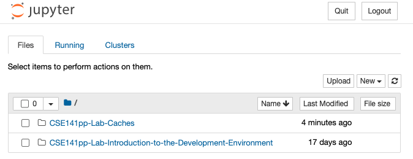
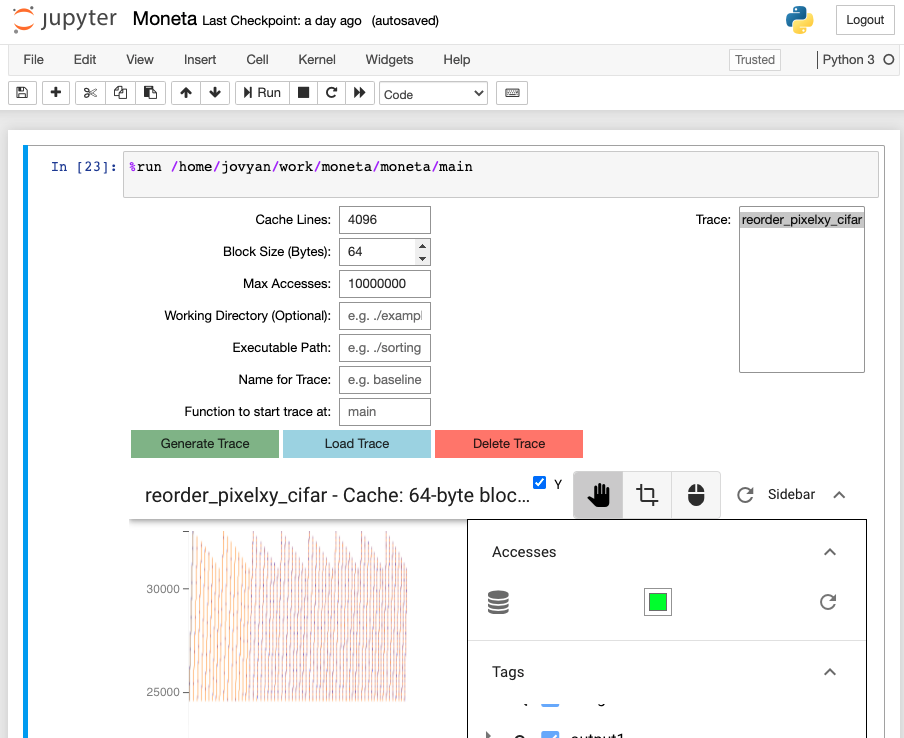

# Caching Optimizations

In this lab, you will applying caching optimizations to the perceptron-based ML model you studied in the previous lab.

This lab will be completed on your own.

Check gradescope for due date(s).

## Grading

Your grade for this lab will be based on your completion of the data collection steps described in this document and the completed worksheet.

| Part                       | value |
|----------------------------|-------|
| Optimizations              | 70%   |
| Worksheet 1                | 15%   |
| Worksheet 2                | 15%   |
    

The optimizations portions of the grade is based on you successfully implemented a series of optimizations in Canela, our CNN library.

The optimizations are broken into three tiers.  A total of 100 points are possible.

* Tier 1: Applying loop re-ordering and tiling to
   `fc_layer_t::activate()`. (20 points)

* Tier 2: Applying loop re-ordering and tiling to
   `fc_layer_t::calc_grads()`.  (20 points)

* Tier 3: Applying additional optimizations to those two functions and
   any others you wish. (60 points)

For Tiers 1 and 2, your score is determined by whether you correctly implement the optimization specified.  They are all-or-nothing: You will receive full credit or zero credit depending on whether your implementation is correct.

For Tier 3, your score will vary depending on how much speedup your optimizations provide for training the neural network.

Your code must pass the regression tests or you'll receive no points on the lab.

Depending on how things go, we may lower (but will not raise) the target speedup for Tier 3.  This will only help you.

## The Leader Board

There is a leader board set up for this lab.  It records the speedup of your code vs the starter code for neural net training.  You can use it to guage your progress.

For this lab, the leader board does not impact your grade.

## Example Code

The `example` directory contains the image stabilization example from
the lab lecture slides.  You shouldn't (and won't need to) use any of
the code from that example for this lab.

The code in `stabilize.cpp` also demonstrates how to use the Moneta
functions (described below) to instrument the program to collect
traces.

## Skills to Learn and Practice

1. Interpreting performance counters.
2. Applying loop reordering and predicting its effects.
3. Applying loop tiling and predicting its effects.
4. Analyzing memeory access patterns with Moneta.
5. Testing code.
6. Quantifying the benefits of optimizations

## Software You Will Need

1. A computer with Docker installed (either the cloud docker container via ssh, or your own laptop).  See the intro lab for details.

2. The lab for the github classroom assignment for this lab.  Find the link on the course home page: https://github.com/CSE141pp/Home/.

3. A PDF annotator/editor to fill out `worksheet1.pdf` and `worksheet2.pdf`. dochub.com might be a good resource. You'll submit this via *a separate assignment* in Gradescope.  We **will not** look at the version in your repo.

4. Moneta - This is currently available on the pod that you obtain using launch-142. 

## Moneta

Moneta is the memory access visualizer tool built by students who took
the first version of this class and who wanted a better way to
understand how their programs were accessing memory.

Moneta has two parts: The first is a *binary instrumenter* that
modifies your executable to record a "trace" of the memory accesses it
performs.  This is based on a very cool tool called
[PIN](https://software.intel.com/content/www/us/en/develop/articles/pin-a-dynamic-binary-instrumentation-tool.html).
This piece of instrumentation is called a "pin tool".

The pin tool does two things:

1.  It records memory accesses.

2.  It simulates a simple cache hierarchy so it can label memory accesses as hits and misses.

It records all this information is file called a trace.

The second piece of Moneta is a trace viewer built using Jupyter
Notebook using a collection of tools for visualizing large data sets.
It lets you quickly load and explore a trace file.

The visualizer displays a graph with relative address on the vertical
access and memory access number on the horizontal axis.  This gives
you a visual depiction of how the processor is accessing memory over
time.

Using Moneta has three steps: Adding some special functions to your
code to tell Moneta what you want to trace, collecting a trace, and
then visualizing it to learn something.

### Instrumenting your Code to Collect a Moneta Trace

Your program accesses a lot of memory -- the stack, the heap, all your
data structures, a bunch of stuff from the standard libraries, etc.
This can make it very hard to find what you are looking for when you
are trying to optimize a particular function.

In addition, if you recorded all the memory accesses a large program
performed, it would take many, many GBs of storage and probably hours
to process.

To avoid these problems, Moneta provides a facility to:

1.  Mark regions of memory with 'tags' so you can find them easily.
2.  Turn tracing on and off.

Both these mechanisms work by inserting calls to special functions
that Moneta can identify.  You'll need to `#include<pin_tags.h>` to
use these:

* `START_TRACE()` -- Turns on tracing. If you don't call `START_TRACE`
  _nothing_ will be recorded.
* `STOP_TRACE()' -- Turns off tracing.  Nothing will be recorded until you call `START_TRACE` again.
* `DUMP_START(const char* tag, const void* begin, const void* end, bool create_new)` -- Opens a _tag_ which will label accesses between `begin` and `end` with the `tag`.  All operations in that range until `DUMP_STOP` is called with the same tag will be part of the tag.

`DUMP_START` takes four parameters:

1. `tag`: A string name to identify the trace
2. `begin`: Identifies the memory address lower bound to trace (Array/Vector Example: &arr[0])
3. `end`: Identifies the memory address upper bound to trace (Array/Vector Example: &arr[arr.size()-1])
4. `create_new`:  If the `tag` name has not been used before, then `create_new` is ignored.If the tag name has been used before then, if `create_new` is `true`, then the tags will start having an index, `tag0`, `tag1`, ...     If `create_new` is false, then the tracing will add the information to the last tag of the same name, so the same tag.

* `DUMP_STOP(const char* tag)` -- Closes a tag.

* `DUMP_START_ALL(const char * tag)` -- A wrapper around `DUMP_START`
  that create a tag that track _all_ memory accesses.  This is useful
  for tagging all the memory accesses that occur during a period of
  time.  You can close the tag with `DUMP_STOP`.  For instance, you
  can use this to tag all the memory operations that occur in a
  function.

**Note:** Once you create a tag, you can't create a new tag with the
  same name that covers a different address range.  If you do, you'll
  get an error like "Error: Tag redefined - Tag can't map to different
  ranges".

**Note:** Due to memory limitations on `dsmlp`, we can only reliably
  record 10 million memory accesses. This is not that many.  You'll
  need to carefully choose where and when to enable tracing.  A good
  practice is to call `START_TRACE()` right before the code you want
  to trace and `STOP_TRACE()` when you're done.  The program will stop
  running after it traces 10M memory operations.

### Collecting Traces

**You can only generate Moneta traces inside the class Docker image on `dsmlp` (or your own machine).  Moneta never runs in the cloud.**

The simplest way to collect a trace is at the command line using the lab's `Makefile`:

```
make traceme_trace
```

will run run the code in `traceme.cpp` and generate a trace (try it!).  You'll have these files:

```
meta_data_traceme.txt
tag_map_traceme.csv
trace_traceme.hdf5
```

These are the "trace" of the program's execution.

Likewise,

```
make code_trace
```

will run your code with the same command line arguments as `make
code.csv`.  After you run it, you'll find three files:

```
meta_data_code.txt
tag_map_code.csv
trace_code.hdf5
```

### Launching Moneta

Moneta runs inside Jupyter Notebook and you will access via a web browser.  **To access Moneta, you must be connected to the campus VPN**.

After you log into dsmlp-login.ucsd.edu, and run `launch-142` as usual, you'll see something like this:

```
ucsdnvsl/cse141pp:sp21.150 is now active.

Please connect to: http://dsmlp-login.ucsd.edu:19589/?token=a4da2a4c6d82c31d9525ba51b3c734fd2e748d3ea929eafa675b3166e4b10a

Connected to sjswanson-32617; type 'exit' to terminate pod/processes and close Jupyter notebooks.
/course/CSE141pp-Config ~

```

Visit the url provided after "Please connect to:".  This should open a window showing the contents of your login directory on `dsmlp-login` like this:



From there, you can navigate to the `Moneta.ipynb` in your lab repo.

At the top is  box that says

```
%run /home/jovyan/work/moneta/moneta/main
```

Click on the text and press return.  That should drop you into Moneta:



At top left are some text fields **THAT YOU SHOULD IGNORE AND NOT
USE**.  The only parts of the UI you'll need in this lab is the list
of traces in the box on the right and the "Load Trace" button.

In that box, you should see "traceme".  That's the trace you just built.  Click "Load Trace" to load it.

Click on "Tags" (right hand side) and then click the magnifying glass
next to "both".  It should zoom into the trace of `main` in
`traceme.cpp`.  Take a moment to figure out which part of the program
each of the lines you see represents.

Check out the [video demo](https://youtu.be/s2lRgt2P_kU).

### Moneta Important Notes

2. **We have included an example usage of MONETA's functions described below in the starter code.** You may need to make minimal changes to do the same for other data structures. 

3. Once you are in the jupyter notebook (Moneta.ipynb), enter something random/gibberish in the "Function to start trace at" field if you are using the START_TRACE() function. This is because Moneta will begin tracing at either the location of START_TRACE() or the function in this field, whichever comes first. We want it to start tracing at START_TRACE() or it may max out the number of memory accesses before reaching this point. 

5. To view the trace for a "tag", like "weights" in the example moneta code, de-select the "stack" tag and leave the tag for heap and "weights" selected. Then click the small magnifying glass for "weights". 

6. You will need to pass the command line options in config.env to code.exe when running the jupyter notebook. By default code.exe will run a different dataset. For instance the "Executable Path" should be code.exe --dataset cifar100. This will make sure you are running on cifar100. 

## Tasks to Perform

### Inspect The Code

Check the [video tour of the CNN library](https://youtu.be/5AfX9xaBsY0).

There are three source files in the lab, but you'll only be editting one:

1.  `main.cpp` -- The driver code is in `main()` (mostly data collection and command line parsing).  Also, code for creating, training, and running ML models. 

2.  `opt_cnn.hpp` -- A soon-to-be-optimized (by you) version of two CNN primitives.  

There is a `code.cpp` but you won't use it in this lab.

You will only be editing `opt_cnn.hpp`.  Changes to the `main.cpp` will have no effect on the autograder's output.

The basic flow is like this:

* Execution starts in `main.cpp` which loads the input dataset.

* `main.cpp` executes the "canary" to verify the machine is performing properly.

* It measures the performance of your implementation of   `fc_layer_t::activate()` for Tier 1 grading.

* It measures the performance of your implementation of   `fc_layer_t::calc_grads()` for Tier 2 grading.

* It measures the performance of neural net training using your optimized functions for Tier 3 grading.

You'll find two skeleton classes in `opt_cnn.hpp`.  They inherit from the corresponding classes in Canela.  Right now, they have no code, so using them is the same as using original Canela classes.

To optimize them, you should copy the functions from Canela you want to optimize into these classes.  Any changes you make will effect the performance correctness of the code in `main.cpp`.

### Test Locally

Like last time, get started by checking out the code and checking it locally with 

```
runlab --devel
```

The code will run for a while.  On our machine, the starter lab runs for about 140s.  Your local machine may be slower or faster.

You'll get a few files:

1. `regression.out` has the report from the regression suite.

2. `benchmark.csv` is the csv file used to measure performance. `CMD_LINE_ARGS` has no effect.

3. `code.csv` is similar to `benchmark.csv` but `CMD_LINE_ARGS` has its normal effect.

4. `code.gprof` and `benchmark.gprof` are not here now, but if you set `GPROF=yes` they will appear.

You can submit it to the autograder for good measure, if you want.

### Command Line Options

Your executable takes a few useful command line options we haven't discussed:

* `--scale` this sets the input size for the input data set.  The bigger the   scale, the more inputs we run through the model.  This only affects the   execution of `train_model`.
  
* `--reps` how many times to run the individual functions for Tier 1 and Tier  2.

* `--function` let's you specify which functions to run.  It can take any combination of `calc_grads`, `activate`, `fix_weights`, `train_model`, and `all`.

* `--test-layer` Takes one or more numbers that corresponding to the layers of the model to test.  For this lab, there's just one layer so the only value that makes sense is 0 (which is also the default).

### Read the Source

You need to get acquainted with the code you'll be optimizing.  The slides from the lab lecture are an important resource here, especially for memory layout of `tensor_t` and how the functions in `fc_layer_t` work.

The baseline version of Canela is in your docker repo in `/course/CSE141pp-SimpleCNN/CNN`.  You should read through the commented code in these files:

* `tensor_t.hpp`

* `types.hpp`

* `fc_layer.hpp`

* `layer_t.hpp`

In each of these files there's some code near the top that has lots comments.  This is the code you should focus on.  There's a lot more code down below, but it's all utility functions and debugging support. It's not important to the operation of the library or your optimizations.

The point is not deeply understand the code at this point.  Rather, it's to become acquainted with where the code is.  This will make it easier to answer questions about the code that you have later.

`tensor_t` is especially important as far as memory optimazitons go because it's the data structure that holds almost all the memory in the models.  Understanding how it maps `x`,`y`,`z`, `b` to linear indexes into the internal array that holds the data is going to be very important.  This was covered in the lecture in detail.


### Tier 1: Optimizing One Function

To get you started, we will walk you through the process for optimizing one function: `fc_layer_t::activate()`.  Please see the slides in the lab repo for more details.  They contain detailed description of how the code works.

The code for the baseline implementation lives in `/course/CSE141pp-SimpleCNN/CNN/fc_layer.hpp`.  Copy that version of `activate()` into your `opt_cnn.hpp`.  Make it a method of `opt_fc_layer_t` class.

Make sure this didn't break anything by doing `runlab --no-validate`. It should finish with

```
[  PASSED  ] 5 tests.
```

Which means that your implementation matches the result of the baseline (which is no surprise because you copied the baseline).

These tests are your best friend, since they provide a quick and easy way of telling whether your code is correct.  `runlab` runs the tests every time, and if you the last line shows any failures, you should look at `regressions.out` for a full report.

**Note** Regressions are always built without optimizations (`-O0`) to make them debuggable. 
**Note** The cache size for our machine in devel is L1-dCache: `32kb`, L1-Icache: `32kb`, L2: `256kb`, L3: `8Mb`.


#### Loop Reordering
Before you do anything to the Loop, the first thing you want to do is to check the cache performance of the original code you copied from the CNN library. To do this, you are going to do something similar to what the previous lab did on the performance counter. Edit your `config.env` to check it's L1 cache misses/instruction by adding `--stat-set L1.cfg` to `CMD_LINE_ARGS`. 

Repeat this for the L2 and L3 using `L2.cfg` and `L3.cfg`. 

The nesting order for the main loop is initially `b`, `i`, `n`.  Modify the code so make the nesting order `b`, `n`, `i`.  This is very similar to changes we discussed in class regarding the stabilization example.  Run the regressions and run the code through the autograder. Check the cache performance again after you modify the code using the same technique shown above. There is also a worksheet exercise related to loop reordering and moneta. 


#### Loop Tiling

Next, we will tile the `n` loop.  Proceed in two stages:

**Stage 1** Create new loop that wraps the `n` loop indexed with `nn`.  The variable `nn` should start at 0 and increment by a constant `TILE_SIZE`.  `nn` will track the beginning index of the current tile.

Rewrite the `n` loop's initialization and termination condition so that:

1.  It starts at the beginning of the tile.
2.  It stops at the end of the tile *or* the end of the tensor (i.e., the original loop bound).

The resuling nesting order should be `b`, `nn`, `n`, `i`.  Run the regressions to ensure that you didn't break anything.

Add a `#define TILE_SIZE 4` above the loop body.

**Stage 2** Make the `nn` loop the outermost loop in the main loop.  The resuling nesting order should be `nn`, `b`, `n`, `i`.  Run the regressions to ensure that you didn't break anything.

Submit to the autograder.  If you've done everything correctly, your code should pass Tier 1.  The precise target for the speedup is listed in gradescope output. At this point you may want to run moneta since there is an exercise in the worksheet to observe the effects of tiling. Apart from moneta, you may also want to do the same thing as listed above in loop reordering for the cache behavior.

### Tier 2: Optimizing calc_grads

For Tier 2, you need apply the same two optimizations to `calc_grads`.

First, reorder the loops so that the nesting order in the triply-nested loop is `b`, `n`, `i`.

And apply tiling on `n` and so you have `nn`, `b`, `n`, `i`.

If you do that successfully, your code should pass Tier 2. Do the cache behavior same as the above two and put the result in your worksheet. The precise target for the speedup is listed in gradescope output.

### Tier 3:  Other optimizations

Go forth and optimize!

There are more opportunities to apply loop reordering tiling across `activate()` and `calc_grads()`.  There may also be other functions worth looking at (How could you find them?). Feel free to use Moneta to guide your optimizations. You can apply whatever optimizations you want with the following restrictions:

1. You can't modify `main.cpp`

2. No threads (that's a later lab).

3. To explicit vectorization (that's a later lab).

The target speedup for Tier 3 is 3x on the full training function with includes, `activate()` and `calc_grads`.

## Testing

The lab includes a regression test in `run_tests.cpp`.  The tests are written using the `googletest` testing framework (which is pretty cool, and if you ever need to test C/C++ code, you should conisder using it.)

A test case looks like this:

```
TEST_F(OptimizationTests, level_0_fc) {
        fc_test<opt_fc_layer_t>(1,1,1,1,1,1);
}
```

The name of this test is `level_0_fc`.  The rest of the strange function signature is `googletest` boilerplate.

There are several sets of tests (`level_0...`, `level_1...` etc. for each kind of layer that Canela supports.  The idea is that the `level_1` tests are harder than the `level_0` tests and so on.

Each set of tests calls a `<layer>_test` with several parameters.  The parameters are input size, output size, and parameters for that type of layer.  For details, look at the `.hpp` file for the layer type in `/course/CSE141pp-SimpleCNN/CNN/`

The final level of tests runs some randomized tests.  `RAND_LARGE(x)` returns a random number between x and 2*x.

You can and should run the test suite locally.  You don't need cloud machines to test correctness.  `runlab` runs it automatically.

You can also run it by hand with `run_tests.exe`.  You can also debug it using `gdb`. 

You can also add tests, but be aware that `run_test.cpp` is not copied to the cloud, so your new tests won't run there.

## Debugging 

Canela has some debugging support built in.  If you a regression fails, you'll get a very lengthy report about it.  For instance:

```
[==========] Running 1 test from 1 test suite.
[----------] Global test environment set-up.
[----------] 1 test from OptimizationTests
[ RUN      ] OptimizationTests.level_1_fc
/home/root/CSE141pp-SimpleCNN/CNN/fc_layer.hpp:174: Failure
Here's what's different. '#' denotes a position where your result is incorrect.
Diff of ->in: <identical>
Diff of ->out: <identical>
Diff of ->grads_in: <identical>
Diff of ->input: <identical>
Diff of ->weights:
z = 0:
################################################################
################################################################
################################################################
################################################################

Diff of ->gradients: <identical>


```

The line with `[ RUN    ]` gives the test that failed.

What follows is a map showing what parts of the layer's data structures are incorrect.  In this case `in`, `out`, 'grads_in`, `input`, and `gradients` are correct.  However, `weights` (which is 65x4x1 tensor) is wrong in every position, if a position was correct, there would be a `.` instead of a `#'.

THe `z = 0` means that this is 'slice' through the tensor at `z=0`. If the tensor more was more 3-dimensional, there would be several blocks of `.` and `#`.

You to see how wrong the values are, you can pass `--print-deltas` as the _first_ argument to `run_tests.exe`.  You'll get something like this:

```
/home/root/CSE141pp-SimpleCNN/CNN/fc_layer.hpp:174: Failure
Here's what's different. '#' denotes a position where your result is incorrect.
Diff of ->in: <identical>
Diff of ->out: <identical>
Diff of ->grads_in: <identical>
Diff of ->input: <identical>
Diff of ->weights: 
z = 0: 
-0.0014 -0.0011 -0.0015 -0.00095 -0.0018 -0.0015 -0.00073 -0.0016 -0.001 -0.0019 -0.0016 -0.00094 -0.0013 -0.00036 -0.00057 -0.0014 -0.00062 -0.0011 -0.0013 -0.0011 -0.0013 -0.00055 -0.0015 -0.00094 -0.00017 -6.9e-06 -0.00039 -0.00055 -0.00018 -0.00083 -0.0017 -0.00026 -0.0014 -0.0013 -0.00023 -0.00031 -0.0012 -0.00063 -0.0018 -0.00088 -0.0005 -0.0016 -0.0015 -0.00034 -0.00021 -0.0018 -0.0017 -0.0011 -0.00038 -0.00055 -0.0013 -0.00052 -0.00049 -0.00036 -0.0017 -0.0016 -0.0017 -0.00063 -0.001 -0.0013 -0.00069 -0.0017 -0.0017 -0.00094 
-0.0012 -0.00094 -0.0012 -0.00081 -0.0015 -0.0013 -0.00063 -0.0014 -0.00087 -0.0016 -0.0014 -0.00081 -0.0011 -0.00031 -0.00048 -0.0012 -0.00054 -0.00097 -0.0011 -0.00094 -0.0011 -0.00047 -0.0013 -0.0008 -0.00014 -6.1e-06 -0.00033 -0.00047 -0.00015 -0.00071 -0.0015 -0.00023 -0.0012 -0.0011 -0.0002 -0.00027 -0.0011 -0.00054 -0.0015 -0.00076 -0.00042 -0.0013 -0.0013 -0.00029 -0.00018 -0.0016 -0.0015 -0.00098 -0.00033 -0.00047 -0.0011 -0.00045 -0.00042 -0.00031 -0.0015 -0.0014 -0.0014 -0.00054 -0.00089 -0.0011 -0.00059 -0.0015 -0.0014 -0.0008 
-0.00029 -0.00023 -0.00031 -0.0002 -0.00037 -0.00031 -0.00015 -0.00035 -0.00021 -0.0004 -0.00035 -0.0002 -0.00028 -7.6e-05 -0.00012 -0.00029 -0.00013 -0.00024 -0.00028 -0.00023 -0.00028 -0.00012 -0.00031 -0.0002 -3.5e-05 -1.5e-06 -8.2e-05 -0.00012 -3.8e-05 -0.00018 -0.00036 -5.6e-05 -0.0003 -0.00027 -4.9e-05 -6.6e-05 -0.00026 -0.00013 -0.00038 -0.00019 -0.00011 -0.00033 -0.00032 -7.3e-05 -4.5e-05 -0.00039 -0.00037 -0.00024 -8.1e-05 -0.00012 -0.00028 -0.00011 -0.0001 -7.7e-05 -0.00037 -0.00034 -0.00035 -0.00013 -0.00022 -0.00028 -0.00015 -0.00037 -0.00035 -0.0002 
-0.00036 -0.00029 -0.00038 -0.00025 -0.00046 -0.00038 -0.00019 -0.00043 -0.00026 -0.00049 -0.00043 -0.00025 -0.00034 -9.3e-05 -0.00015 -0.00036 -0.00016 -0.00029 -0.00035 -0.00029 -0.00034 -0.00014 -0.00038 -0.00024 -4.4e-05 -1.9e-06 -0.0001 -0.00014 -4.7e-05 -0.00022 -0.00045 -6.9e-05 -0.00037 -0.00033 -6e-05 -8.1e-05 -0.00032 -0.00016 -0.00047 -0.00023 -0.00013 -0.00041 -0.00039 -8.9e-05 -5.5e-05 -0.00048 -0.00045 -0.0003 -0.0001 -0.00014 -0.00034 -0.00014 -0.00013 -9.4e-05 -0.00045 -0.00042 -0.00043 -0.00016 -0.00027 -0.00034 -0.00018 -0.00046 -0.00043 -0.00024 

Diff of ->gradients: <identical>

Failure: fc_test(4, 4, 4, 4, 1);

```

You should focus on one failing test at a time.  You can see the tests that are availble with:

```
$ ./run_tests.exe --gtest_list_tests
OptimizationTests.
  level_0_fc
  level_1_fc
  level_2_fc
  level_3_fc
  level_4_fc
$
```

And then you can run just one of them like so:

```
$ ./run_tests.exe --gtest_filter=*level_0_fc*
```

Note the `_` instead of `-` and the `*`.
